# Simulador de Substituição de Páginas

Trabalho de Sistemas Operacionais (UNIPAMPA). Mede o número de falhas de página das
políticas **FIFO**, **OPT** e **LRU aproximado** (bit de referência + N bits de
histórico, envelhecidos a cada I acessos) sobre traces reais de acesso à memória,
variando o número de frames. Também conta as escritas de volta causadas por vítimas
sujas.

## Pré-requisitos (WSL Ubuntu)

```bash
sudo apt install -y g++ make python3-matplotlib
```

## Traces

Os traces não estão no repositório. Baixe-os para `traces/` (use **HTTPS** — por
HTTP o endereço é bloqueado):

```bash
mkdir -p traces
for t in bzip gcc sixpack swim bigone; do
    wget -P traces "https://www.inf.unioeste.br/~marcio/SO/trace/$t.trace"
done
```

### O bigone é a concatenação dos outros quatro

Os quatro traces menores têm 1 000 000 de acessos cada; o `bigone` tem 4 000 000. Cada
bloco de 1M de linhas do `bigone` é idêntico, byte a byte, a um dos outros traces, na
ordem `bzip`, `gcc`, `sixpack`, `swim` (todos com fim de linha LF, sem CRLF):

```bash
cd traces
wc -l *.trace
md5sum bzip.trace gcc.trace sixpack.trace swim.trace bigone.trace
for i in 0 1 2 3; do
    sed -n "$((i*1000000+1)),$(((i+1)*1000000))p" bigone.trace | md5sum
done
cat bzip.trace gcc.trace sixpack.trace swim.trace | md5sum   # igual ao md5 do bigone.trace acima
```

| Bloco do bigone | Linhas              | md5                                | Trace igual |
|-----------------|---------------------|------------------------------------|-------------|
| 1               | 1 – 1 000 000       | `599135f701c07b88c01053c4806f001e` | `bzip`      |
| 2               | 1 000 001 – 2M      | `c11811d97de4fc16f816d4dcddb1bcba` | `gcc`       |
| 3               | 2 000 001 – 3M      | `149a73f7fab839e378a408f43a7dc589` | `sixpack`   |
| 4               | 3 000 001 – 4M      | `4fa8d14c991c1c5408c949f9b2fa823b` | `swim`      |

O arquivo inteiro (`386b03adda7ee1bcf2a00138f6ce0a21`) também bate com o md5 da
concatenação dos quatro.

Consequência: o `bigone` **não é um quinto programa independente**, e sim uma carga
com **trocas de fase** — a cada 1M de acessos o conjunto de páginas em uso muda de
programa. Por isso ele fica **fora da média da varredura exploratória** (como já
previa o ADR 0002) e a análise deve tratá-lo à parte, como carga com trocas de fase.

## Uso

```bash
make          # compila → build/sim
make test     # roda os testes
make grid     # simula a grade de experimentos/grid.conf → results/<trace>.csv
make plots    # gráficos → results/figuras/
```

Simulação avulsa:

```bash
./build/sim traces/gcc.trace fifo --frames 4,8,16
./build/sim traces/gcc.trace lru-approx --bits 8 --interval 1000 --frames 4,8,16
```

## Resultados e análise

Os números abaixo vêm de `results/<trace>.csv` (`make grid`) e as figuras de
`results/figuras/` (`make plots`). Todas as tabelas usam um subconjunto dos 18 números
de frames da grade; os CSV têm todos.

### Escolhas da grade

Os valores de `experiments/grid.conf` saíram de uma varredura exploratória registrada
no [ADR 0002](docs/adr/0002-par-de-referencia-e-grade-de-frames.md):

- **Par de referência N:I = 8:100.** Entre os 54 pares varridos, foi o que ficou mais
  perto do OPT em média sem perder do FIFO em nenhum ponto. O 32:100 era só 0,04
  melhor, e com I ≥ 1000 o LRU aproximado já perdia do FIFO em alguns pontos.
- **Frames de 4 a 512, com pontos densos até 32.** Os joelhos das curvas caem entre
  12 e 40 frames, e o bzip tem um salto de 10 para 12 frames que uma grade dobrando
  (8, 16, …) não pegaria. A grade vai até 512 porque só o bzip satura antes disso.
- **Pares de sensibilidade.** Varia N com I = 100 (2, 4, 16, 32) e varia I com N = 8
  (10, 1000, 10⁴, 10⁵).

Para comparar as políticas, as tabelas usam a mesma **posição** do ADR:

    posição = (falhas_LRU − falhas_OPT) / (falhas_FIFO − falhas_OPT)

Posição 0 é o OPT, 1 é o FIFO e acima de 1 é pior que o FIFO. Ela aparece como "—"
quando FIFO e OPT diferem em até 1000 falhas de página, porque aí a razão é só ruído.

### Falhas de página por trace

Os traces têm 1 000 000 de acessos cada; o bigone tem 4 000 000. O número de páginas
distintas (ADR 0002) é o piso de falhas de página, já que as falhas compulsórias entram
na contagem: bzip 317, gcc 2852, sixpack 3890, swim 2543, bigone 8254.

#### bzip

| Frames | FIFO | OPT | LRU aprox. 8:100 | Posição |
|---:|---:|---:|---:|---:|
| 4 | 128 601 | 78 562 | 112 197 | 0,67 |
| 8 | 47 828 | 18 251 | 29 205 | 0,37 |
| 12 | 4581 | 2978 | 4023 | 0,65 |
| 16 | 3820 | 2427 | 3430 | 0,72 |
| 24 | 3236 | 1735 | 2870 | 0,76 |
| 32 | 2497 | 1330 | 2257 | 0,79 |
| 64 | 1467 | 821 | 1387 | — |
| 128 | 891 | 497 | 884 | — |
| 256 | 511 | 317 | 511 | — |
| 512 | 317 | 317 | 317 | — |

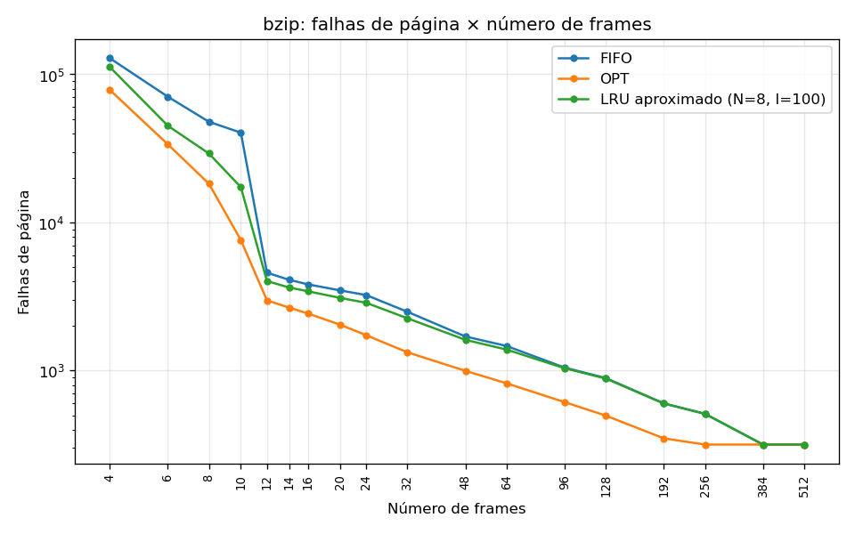

#### gcc

| Frames | FIFO | OPT | LRU aprox. 8:100 | Posição |
|---:|---:|---:|---:|---:|
| 4 | 302 860 | 185 754 | 297 010 | 0,95 |
| 8 | 205 368 | 118 480 | 183 514 | 0,75 |
| 12 | 162 233 | 93 781 | 140 669 | 0,68 |
| 16 | 138 539 | 80 307 | 118 351 | 0,65 |
| 24 | 112 957 | 65 013 | 96 349 | 0,65 |
| 32 | 98 067 | 55 802 | 83 924 | 0,67 |
| 64 | 70 315 | 38 050 | 59 484 | 0,66 |
| 128 | 48 526 | 24 391 | 45 241 | 0,86 |
| 256 | 31 698 | 12 667 | 30 826 | 0,95 |
| 512 | 15 609 | 5662 | 15 493 | 0,99 |

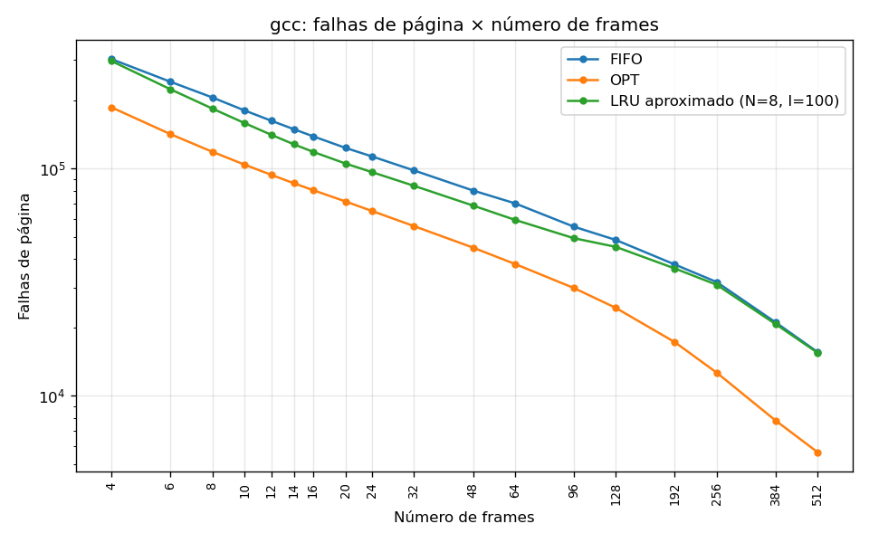

#### sixpack

| Frames | FIFO | OPT | LRU aprox. 8:100 | Posição |
|---:|---:|---:|---:|---:|
| 4 | 351 810 | 197 551 | 270 706 | 0,47 |
| 8 | 230 168 | 116 407 | 178 770 | 0,55 |
| 12 | 173 204 | 85 779 | 134 006 | 0,55 |
| 16 | 140 083 | 69 325 | 107 976 | 0,55 |
| 24 | 103 563 | 51 576 | 80 061 | 0,55 |
| 32 | 85 283 | 41 955 | 66 826 | 0,57 |
| 64 | 48 301 | 22 083 | 42 019 | 0,76 |
| 128 | 27 778 | 11 690 | 24 700 | 0,81 |
| 256 | 15 440 | 5981 | 14 917 | 0,94 |
| 512 | 8089 | 4125 | 7945 | 0,96 |

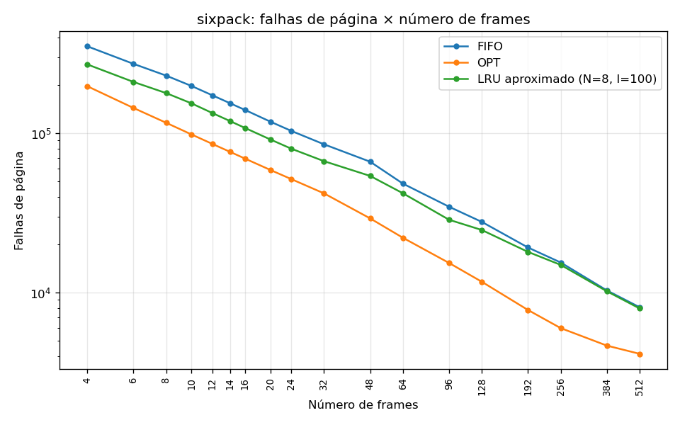

#### swim

| Frames | FIFO | OPT | LRU aprox. 8:100 | Posição |
|---:|---:|---:|---:|---:|
| 4 | 419 509 | 270 046 | 348 046 | 0,52 |
| 8 | 330 893 | 171 244 | 278 376 | 0,67 |
| 12 | 259 522 | 116 727 | 206 997 | 0,63 |
| 16 | 214 295 | 78 312 | 159 820 | 0,60 |
| 24 | 122 033 | 41 751 | 71 351 | 0,37 |
| 32 | 81 638 | 28 826 | 47 214 | 0,35 |
| 64 | 30 422 | 14 289 | 23 139 | 0,55 |
| 128 | 17 523 | 6518 | 16 499 | 0,91 |
| 256 | 8551 | 3572 | 8358 | 0,96 |
| 512 | 4850 | 2672 | 4813 | 0,98 |

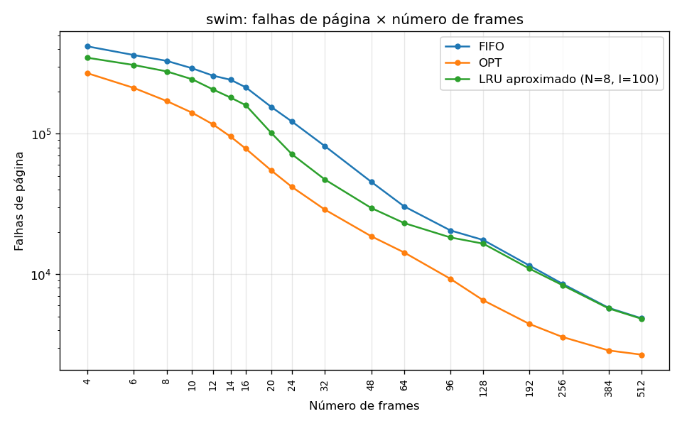

### Comparação com o limite inferior do OPT

Nenhuma política fica abaixo do OPT em nenhum ponto, como esperado. O FIFO gera de
**1,5 a 2,9 vezes** as falhas de página do OPT, fora a faixa saturada do bzip e o
bzip com 10 frames (5,3 vezes, logo antes do salto de 10 para 12 frames). O LRU
aproximado 8:100 fica **sempre entre os dois**, com posição de 0,30 a 0,99 em toda a grade, mas a
vantagem dele sobre o FIFO depende muito do número de frames:

- **Faixa intermediária (≈ 8 a 64 frames)** é onde ele mais se aproxima do OPT. No
  swim chega a 0,35 em 32 frames (47 214 falhas de página, contra 81 638 do FIFO), no
  sixpack fica estável em 0,55 de 8 a 32 frames e no gcc entre 0,65 e 0,68 de 16 a 64.
- **Muitos frames (≥ 128)**: a posição sobe para 0,86–0,99 em todos os traces, ou seja,
  o LRU aproximado **converge para o FIFO**. Com 8 bits de histórico e I = 100, uma
  página só guarda informação de uso dos últimos 8 × 100 = 800 acessos. Com centenas
  de frames, a maioria das páginas residentes não foi tocada nesse horizonte: todas
  ficam com bit de referência desligado e histórico zerado. A escolha da vítima então
  cai no último desempate, a página carregada há mais tempo, que é exatamente o FIFO.
  O experimento de sensibilidade confirma isso: aumentar o horizonte, por N ou por I,
  melhora o LRU aproximado justamente nessa faixa.
- **Poucos frames no gcc (4 frames, posição 0,95)**: o gcc tem pouca localidade de
  curto prazo. Mesmo o OPT erra 18,6% dos acessos com 4 frames, e quase não sobra
  recência para o LRU aproximado aproveitar.

### Onde as curvas se separam e onde saturam

- **Separação.** Nas escalas log das figuras, as três curvas correm quase paralelas
  com poucos frames e se afastam na região do joelho (12 a 40 frames, ADR 0002). No
  swim, a queda do FIFO entre 14 e 32 frames (242 630 → 81 638) é mais lenta que a do
  OPT (95 530 → 28 826) e a do LRU aproximado (181 155 → 47 214), e é ali que o LRU
  aproximado tem a melhor posição. No bzip, as três políticas despencam juntas de 10
  para 12 frames (o FIFO cai de 40 385 para 4581): o conjunto de páginas em uso do
  laço principal passa a caber na memória, e o que sobra depois disso são poucas
  falhas de página espalhadas.
- **Saturação.** Só o **bzip** satura dentro da grade. O OPT chega às 317 falhas
  compulsórias com 256 frames, e FIFO e LRU aproximado chegam lá com 384, quando todas
  as 317 páginas distintas cabem na memória e nenhuma vítima é escolhida. Entre 48 e
  256 frames, FIFO e OPT diferem em menos de 1000 falhas de página (0,1% dos acessos):
  a política importa pouco depois do joelho. gcc, sixpack, swim e bigone **não
  saturam até 512 frames**. O OPT em 512 frames ainda está em 2,0× (gcc), 1,1×
  (sixpack), 1,1× (swim) e 1,5× (bigone) o número de páginas distintas, então a escolha
  da política continua pesando: o FIFO faz de 1,8 a 2,8 vezes as falhas de página do
  OPT nesse ponto.

### Experimento de sensibilidade: N e intervalo de envelhecimento

Falhas de página do LRU aproximado com **8 frames** (poucos frames):

| N:I | bzip | gcc | sixpack | swim | bigone |
|---|---:|---:|---:|---:|---:|
| FIFO | 47 828 | 205 368 | 230 168 | 330 893 | 814 257 |
| 2:100 | 32 261 | 184 419 | 179 407 | 278 409 | 674 496 |
| 4:100 | 31 347 | 183 573 | 178 836 | 278 395 | 672 151 |
| **8:100** | 29 205 | 183 514 | 178 770 | 278 376 | 669 865 |
| 16:100 | 29 180 | 183 513 | 178 765 | 278 376 | 669 834 |
| 32:100 | 29 057 | 183 513 | 178 765 | 278 376 | 669 711 |
| 8:10 | 32 704 | 168 905 | 173 077 | 280 656 | 655 342 |
| 8:1000 | 31 766 | 215 242 | 199 842 | 286 297 | 733 147 |
| 8:10000 | 34 215 | 223 408 | 218 177 | 302 124 | 777 924 |
| 8:100000 | 39 810 | 223 908 | 228 738 | 321 092 | 815 474 |
| OPT | 18 251 | 118 480 | 116 407 | 171 244 | 424 381 |

Falhas de página do LRU aproximado com **256 frames** (muitos frames):

| N:I | bzip | gcc | sixpack | swim | bigone |
|---|---:|---:|---:|---:|---:|
| FIFO | 511 | 31 698 | 15 440 | 8551 | 56 193 |
| 2:100 | 511 | 31 449 | 15 323 | 8478 | 55 747 |
| 4:100 | 511 | 31 195 | 15 203 | 8403 | 55 305 |
| **8:100** | 511 | 30 826 | 14 917 | 8358 | 54 597 |
| 16:100 | 509 | 30 021 | 14 299 | 7889 | 52 704 |
| 32:100 | 508 | 28 241 | 13 169 | 7438 | 49 332 |
| 8:10 | 511 | 31 628 | 15 368 | 8521 | 55 999 |
| 8:1000 | 392 | 25 314 | 11 982 | 6862 | 44 528 |
| 8:10000 | 466 | 24 431 | 10 715 | 5700 | 41 273 |
| 8:100000 | 502 | 27 171 | 12 630 | 6980 | 47 140 |
| OPT | 317 | 12 667 | 5981 | 3572 | 22 434 |

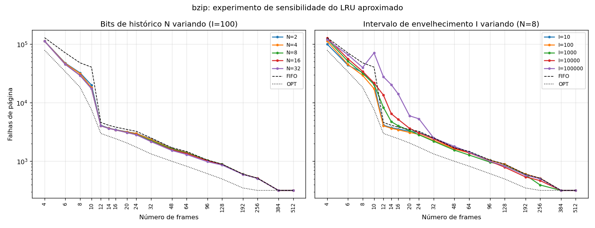
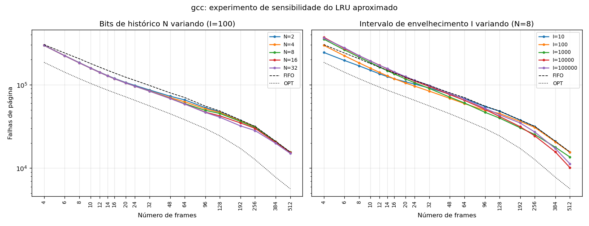
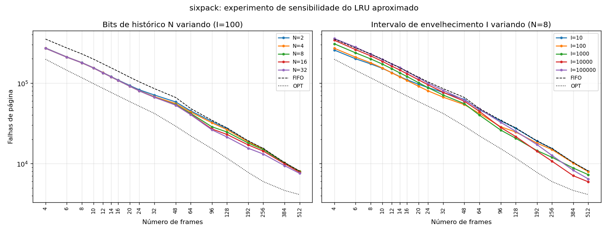
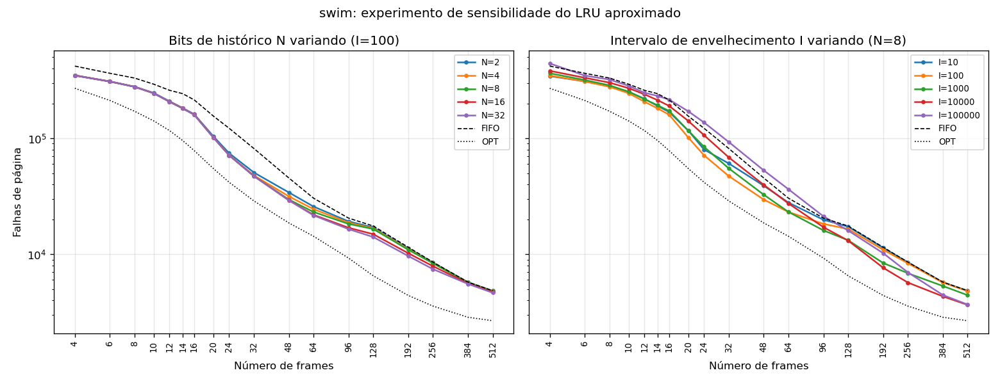

Leitura:

- **O intervalo de envelhecimento pesa muito mais que N.** Com 8 frames, ir de 2 para
  32 bits muda o gcc em 0,5% e o swim em 0,01%. Variar I de 10 para 10⁵ muda o gcc em
  33% e o swim em 14%.
- **O melhor I cresce com o número de frames.** Com 8 frames, o melhor é I = 10 (gcc,
  sixpack, bigone) ou I = 100 (bzip, swim), e I ≥ 1000 já perde para o FIFO no gcc.
  Com 256 frames a ordem se inverte: o 8:10 é o pior dos pares (empatado no bzip) e fica
  quase igual ao FIFO, enquanto 8:1000 e 8:10000 são os melhores (no gcc, 24 431 contra 30 826 do
  8:100). A explicação é o horizonte N × I. Com poucos frames, uma página residente é
  reusada logo ou sai logo, e um I curto separa melhor as páginas quentes das frias.
  Com muitos frames, as páginas ficam residentes por milhares de acessos, e um
  horizonte curto zera o histórico de quase todas, o que devolve a política ao FIFO
  (seção anterior).
- **N só ajuda quando o horizonte é curto demais.** Com 256 frames e I = 100, passar de
  8 para 32 bits melhora o gcc em 8% e o bigone em 10%, porque estende o horizonte de
  800 para 3200 acessos. Com 8 frames esse ganho é praticamente nulo.
- **I longo demais também degrada.** Com I = 10⁵, o bit de referência fica ligado em
  quase todas as páginas entre dois envelhecimentos e o histórico quase não muda. A
  política perde a informação de recência e chega a ficar pior que o FIFO em vários
  pontos de todos os traces (no swim, de 16 a 96 frames).
- **Consequência.** Não existe um par N:I bom para todo tamanho de memória. O 8:100 é
  um compromisso que favorece a faixa de poucos frames e o joelho, onde as falhas de
  página são mais numerosas. Num sistema real, o intervalo de envelhecimento deveria
  acompanhar o tempo de residência das páginas, e não ser fixo.

### Escritas de volta

| Trace | Frames | FIFO | OPT | LRU aprox. 8:100 |
|---|---:|---:|---:|---:|
| bzip | 4 | 38 644 | 31 034 | 30 059 |
| bzip | 16 | 1335 | 845 | 1109 |
| bzip | 64 | 514 | 277 | 487 |
| bzip | 256 | 125 | 26 | 125 |
| gcc | 4 | 55 013 | 26 077 | 46 777 |
| gcc | 16 | 24 043 | 11 317 | 14 774 |
| gcc | 64 | 12 053 | 5737 | 8953 |
| gcc | 256 | 5945 | 2507 | 5647 |
| sixpack | 4 | 94 710 | 36 594 | 60 818 |
| sixpack | 16 | 31 314 | 13 958 | 19 591 |
| sixpack | 64 | 11 936 | 6798 | 10 039 |
| sixpack | 256 | 5426 | 2563 | 5265 |
| swim | 4 | 57 750 | 53 858 | 56 135 |
| swim | 16 | 47 434 | 18 131 | 44 260 |
| swim | 64 | 7585 | 4100 | 5912 |
| swim | 256 | 2836 | 1258 | 2737 |
| bigone | 4 | 246 120 | 147 567 | 193 792 |
| bigone | 16 | 104 138 | 44 268 | 79 748 |
| bigone | 64 | 32 145 | 16 974 | 25 446 |
| bigone | 256 | 14 517 | 6588 | 13 955 |

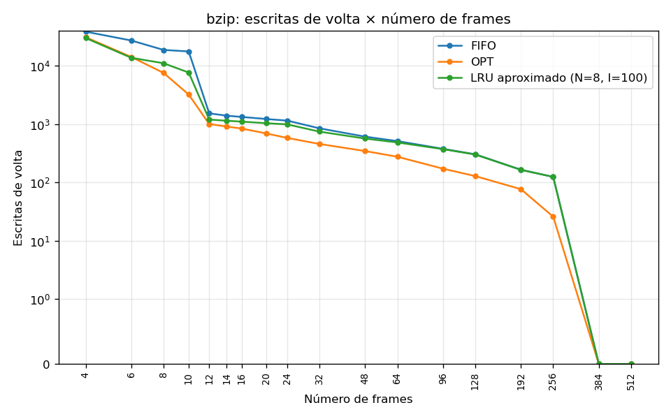
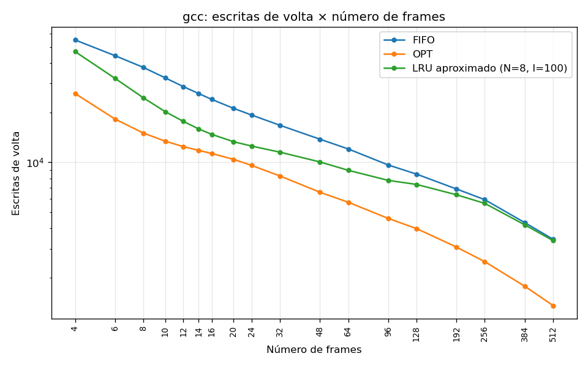
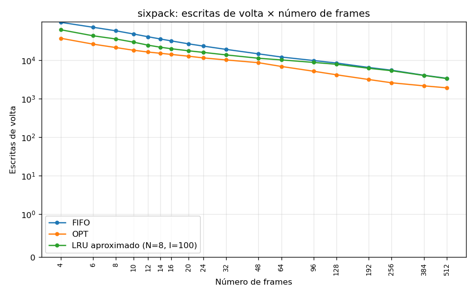
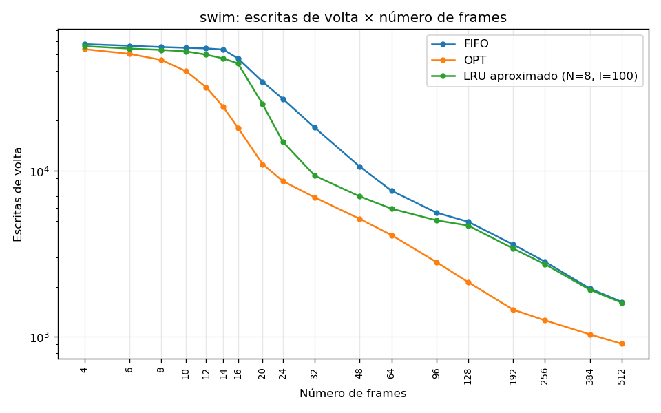

- As escritas de volta **acompanham as falhas de página**: cada falha com memória cheia
  tira uma vítima, e uma parte das vítimas está suja. Nas mesmas condições, a ordem
  entre as políticas costuma ser a mesma das falhas de página (OPT < LRU aproximado <
  FIFO). Com 16 frames, de 12% a 35% das falhas de página geram uma escrita de volta,
  conforme o trace.
- **O OPT não é ótimo em escritas de volta.** Ele minimiza falhas de página, não
  vítimas sujas, e nenhuma política olha o estado sujo/limpo para escolher a vítima.
  No bzip com 4 e 6 frames, o LRU aproximado faz **menos** escritas de volta que o OPT
  (30 059 contra 31 034 com 4 frames), mesmo com 43% mais falhas de página.
- **swim escreve muito.** Com 4 a 14 frames, as escritas de volta do FIFO quase não
  caem (57 750 → 53 555) enquanto as falhas de página caem para 58%. Até o OPT faz
  53 858 escritas de volta com 4 frames, perto do FIFO. As páginas que o swim reusa são
  escritas a cada passagem, então quase toda vítima está suja. As escritas de volta só
  caem de verdade a partir de 16–20 frames, quando o conjunto de páginas em uso começa a
  caber na memória.
- Com muitos frames, as escritas de volta despencam: páginas sujas que nunca são
  escolhidas como vítima ficam sujas até o fim do trace, e essas não contam. No bzip
  com 384 frames, nenhuma página sai e o resultado é 0 escritas de volta.

### Anomalia de Belady

Em nenhum trace o **FIFO** tem mais falhas de página com mais frames entre dois pontos
consecutivos da grade: todas as curvas do FIFO são monotonicamente decrescentes. A
grade não testa todos os números de frames, então isso não descarta anomalias entre
os pontos medidos. Também não é surpresa: a anomalia aparece em sequências de acesso
específicas, e traces reais, com localidade, raramente as produzem.

A única inversão nos CSV é do **LRU aproximado com I = 10⁵** no bzip: 39 810 falhas de
página com 8 frames e 70 655 com 10. O OPT e o LRU exato são algoritmos de pilha e não
sofrem a anomalia. O LRU aproximado não é: com I grande, os desempates pela página
carregada há mais tempo o deixam parecido com o FIFO, e ele herda a mesma fragilidade.
Com o par de referência 8:100, nenhuma inversão aparece.

### bigone: carga com trocas de fase

O bigone é a concatenação exata `bzip + gcc + sixpack + swim` (seção
[Traces](#o-bigone-é-a-concatenação-dos-outros-quatro)). Ele tem três trocas de fase e
fica fora das médias acima.

| Frames | FIFO | OPT | LRU aprox. 8:100 | Posição |
|---:|---:|---:|---:|---:|
| 4 | 1 202 780 | 731 913 | 1 027 959 | 0,63 |
| 8 | 814 257 | 424 381 | 669 865 | 0,63 |
| 12 | 599 540 | 299 264 | 485 695 | 0,62 |
| 16 | 496 736 | 230 369 | 389 577 | 0,60 |
| 24 | 341 789 | 160 072 | 250 630 | 0,50 |
| 32 | 267 469 | 127 910 | 200 219 | 0,52 |
| 64 | 150 507 | 75 228 | 126 027 | 0,67 |
| 128 | 94 715 | 43 058 | 87 319 | 0,86 |
| 256 | 56 193 | 22 434 | 54 597 | 0,95 |
| 512 | 28 828 | 12 364 | 28 528 | 0,98 |

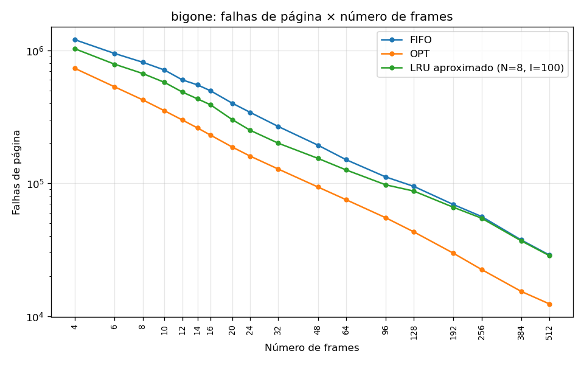
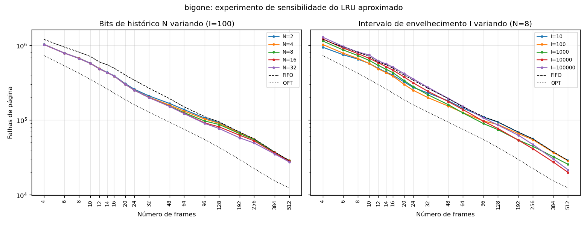
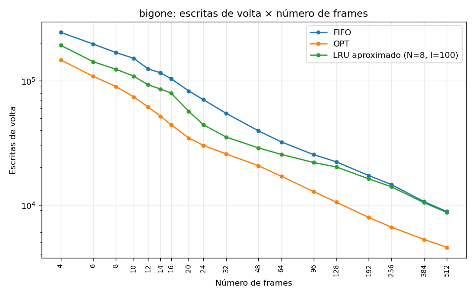

- **As falhas de página do bigone são a soma das dos quatro traces.** Até 12 frames, a
  soma é idêntica nas três políticas, falha por falha (ex.: FIFO com 4 frames:
  1 202 780 nos dois casos), e nos demais pontos da tabela a diferença fica abaixo de
  0,2%. A exceção é o OPT com 256 e 512 frames, que fica 103 (0,5%) e 412 (3,2%)
  falhas de página abaixo da soma. Ou seja, as trocas de fase **não custam nada além das falhas compulsórias**
  que o programa novo teria de qualquer jeito. Em poucos acessos, o programa novo
  substitui por completo as páginas do anterior, e nenhuma política perde tempo
  segurando páginas da fase que acabou.
- O pequeno ganho do OPT com muitos frames é consistente com as páginas compartilhadas
  entre os programas: o bigone tem 8254 páginas distintas, contra 9602 na soma dos
  quatro. Com memória grande, uma página do fim de uma fase pode continuar residente e
  ser reusada pela fase seguinte.
- Por isso a curva e a posição do bigone (0,50 a 0,98) são uma **mistura ponderada**
  das quatro: em que pesam mais, em cada número de frames, os traces com mais falhas de
  página, e sem comportamento próprio. A sensibilidade repete o padrão dos outros traces: I curto
  ganha com poucos frames e I longo ganha com muitos.

### Conclusões

1. O OPT é um limite inferior inalcançável na prática, já que exige o futuro do trace,
   e o FIFO fica de 1,5 a 2,9 vezes acima dele. Essa diferença é o espaço de melhoria
   disponível para uma política realizável.
2. O LRU aproximado recupera parte desse espaço, até 70% (bzip com 10 frames; 65% no swim com 32), usando
   apenas um bit de referência e um histórico por página. Mas o ganho depende do
   intervalo de envelhecimento estar ajustado ao tamanho da memória: com horizonte
   curto e muitos frames ele vira um FIFO, e com horizonte longo e poucos frames ele
   fica pior que o FIFO.
3. O número de frames importa mais que a política até o joelho de cada trace. Depois
   dele, a política volta a fazer diferença relativa (2 a 3 vezes), mas em números
   absolutos bem menores.
4. Escritas de volta seguem as falhas de página, mas não são minimizadas por nenhuma
   das três políticas, porque nenhuma considera páginas sujas na escolha da vítima.
